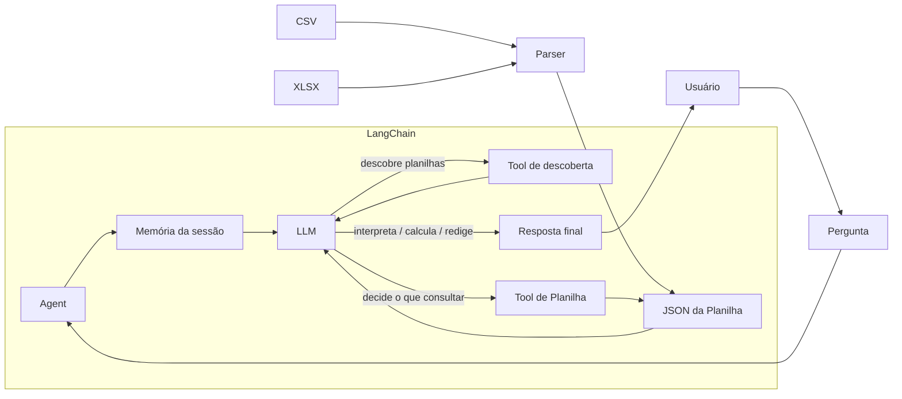

# Arquitetura

## 1. Visão geral

O NLQ responde **perguntas em linguagem natural** sobre dados de planilhas
(CSV e XLSX). O caminho é direto: o agente conversa com o LLM, o LLM decide o que
consultar, uma **ferramenta de planilha** devolve os dados em **JSON**, e o LLM
interpreta, calcula e redige a resposta final.

O agente também mantém **memória da sessão**: o histórico de turnos é gravado por
um checkpointer do LangGraph e devolvido ao LLM a cada pergunta.



O projeto é **agnóstico de planilha**: o núcleo não conhece fórmulas nem layouts
específicos. O que ele faz é ler a estrutura tabular e entregá-la — planilhas
semi-estruturadas ou corporativas exigem interpretação que ainda não existe
(ver [`scale_difficulties.md`](scale_difficulties.md)). Detalhes do agente em
[`agent.md`](agent.md).

## 2. Componentes

| Componente            | Onde                                | Papel                                                            | Estado       |
|-----------------------|-------------------------------------|------------------------------------------------------------------|--------------|
| Interface (CLI)       | `src/nlq/main.py`                   | Recebe a pergunta e imprime a resposta (`rich`)                  | **Atual**    |
| Agente (LangChain)    | `src/nlq/agent/agent.py`            | Orquestra o ciclo LLM ↔ ferramenta                               | **Atual**    |
| LLM (Groq/OpenRouter) | `src/nlq/agent/agent.py`            | Decide o que consultar, interpreta os dados e redige a resposta   | **Atual**    |
| Prompt de sistema     | `src/nlq/agent/prompts/`            | Dois arquivos Markdown concatenados em `system_prompt`           | **Atual**    |
| Tool de planilha      | `src/nlq/tools/extract.py`          | Tool `create_json` registrada no agente; expõe os dados da planilha | **Atual** |
| Tool de descoberta    | `src/nlq/tools/listar_planilhas.py` | Tool `lista_arquivos`; informa quais planilhas existem           | **Atual**    |
| Parser (CSV)          | `src/nlq/tools/extract.py`          | Lê o CSV com `csv.DictReader` e fallback de codificação   | **Atual**    |
| Parser (XLSX)         | `src/nlq/tools/extract.py`          | Lê todas as abas com `openpyxl` e devolve um dict por aba        | **Atual**    |
| Memória de sessão     | `src/nlq/agent/agent.py`            | `InMemorySaver` do LangGraph; acumula os turnos da execução      | **Atual**    |
| Resposta final        | `src/nlq/main.py`                   | Texto devolvido ao usuário                                       | **Atual**    |

## 3. Fluxo de uma pergunta

1. **Entrada** — o usuário digita a pergunta na CLI.
2. **Agente → LLM** — o agente junta a pergunta ao histórico da sessão
   recuperado do checkpointer e encaminha tudo ao modelo.
3. **Decisão** — o LLM decide se precisa descobrir planilhas e/ou consultá-las.
4. **Consulta** — o LLM chama a **tool de descoberta** para saber o que existe e,
   em seguida, a **tool de planilha**; o **parser** lê o arquivo (CSV ou XLSX) e
   devolve o **JSON** dos dados.
5. **Volta ao LLM** — o JSON é devolvido ao modelo como contexto.
6. **Resposta** — o LLM interpreta, calcula e redige a resposta final.
7. **Checkpoint** — as mensagens do turno são gravadas na sessão.
8. **Saída** — a resposta é impressa para o usuário.

Não há etapa separada de validação nem consulta em linguagem estruturada: o LLM
faz a interpretação e o cálculo sobre o JSON. O histórico é gerenciado pelo
checkpointer, não por código de conversação na CLI.


### Fluxo alvo para escala

O fluxo atual é mantido por simplicidade, mas o alvo é evitar que toda pergunta
reenvie a planilha inteira ao modelo:

```text
Planilha
   ↓
parser / normalização
   ↓
representação local
   ↓
┌──────────────────────┬──────────────────────┐
│ executor tabular     │ busca semântica      │
│ filtros/agregações   │ registros candidatos │
└──────────────────────┴──────────────────────┘
             ↓
       contexto reduzido
             ↓
            LLM
```

Cachear o arquivo pode reduzir custo de I/O, mas o ganho principal esperado vem
da **seleção local antes do LLM**.

## 4. Princípios de projeto

- **Fidelidade** — a resposta deve refletir exatamente os dados; nada de inferir
  valores ausentes.
- **Confiabilidade** — falhas de execução devem ser explícitas e recuperáveis, não
  silenciosas.
- **Rastreabilidade** — a resposta é acompanhável até o dado de origem.
- **Agnóstico de planilha** — o núcleo não pode assumir um layout específico.
- **Extensibilidade** — novas ferramentas e novos modelos entram sem reescrever
  o núcleo.

O agnosticismo se mantém no **parser**, não na identidade: o arquivo de prompt
`specific_role.md` define o escopo do agente e é editável pelo usuário, sem que o
núcleo dependa do seu conteúdo.

## 5. Dívidas técnicas conhecidas

### Payload e contexto

- **`json.dumps` com `indent=2`** — a indentação aumenta o payload enviado ao LLM;
  em XLSX multi-aba o JSON completo pode se aproximar do `max_tokens` (7000 Groq /
  10000 OpenRouter).
- **Ausência de dado não sinalizada** — a tool devolve o dict cru, sem marcar
  `n/a` ou célula vazia.
- **Falha de leitura sem tratamento** — `FileNotFoundError` e erros de parsing sobem
  direto para o LLM.

### Parser XLSX

- **Níveis 3 e 4 lidos de forma bruta** — `read_excel` faz `dict(zip(headers, row))`
  na primeira linha, então:
  - células mescladas aparecem como `None`;
  - cabeçalho multinível vira uma única coluna com nome do primeiro nível;
  - com `data_only=True`, fórmula sem valor em cache devolve `None`;
  - múltiplos blocos na mesma aba viram uma tabela só;
  - abas ocultas também são lidas.
- `load_workbook` recebe `read_only=True` e `data_only=True`, então fórmulas nunca
  são calculadas pelo projeto.

### Sessão e memória

- **Memória volátil** — `InMemorySaver` guarda em RAM; encerrar o processo
  descarta a sessão.
- **`thread_id` fixo em `"default"`** — uma única sessão por execução, sem
  separação de conversas nem concorrência.

### Acesso a disco

- **Path sem validação** — `name` e `ext` não são sanitizados, então um `name`
  como `../../.env` escapa de `sheets/`.
- **`ext` acoplado ao layout** — a extensão também nomeia a pasta em `sheets/`.
- **`lista_arquivos` sem guardas** — `listar_csvs` e `listar_xlsx` são
  implementações duplicadas, sem tratamento para pasta ausente e sem filtro por
  extensão (`iterdir()` devolve qualquer arquivo).

### Agente e configuração

- **As duas chaves de API são obrigatórias** — os dois modelos são construídos
  antes da escolha, logo falta de `GROQ_API_KEY` derruba a inicialização mesmo
  usando OpenRouter.
- **`model` pode ficar sem atribuição** — `API_SELECT` inesperado com chave do
  OpenRouter válida resulta em `UnboundLocalError`.
- **`requests` usado sem estar declarado** em `pyproject.toml`.
- **`check_openrouter_key()` faz chamada de rede** a cada criação do agente,
  inclusive quando a autodetecção já é redundante.
- Sem testes automatizados.

## 6. Direção de evolução

A prioridade arquitetural é **reduzir o volume de dados enviado ao LLM**. O fluxo
atual envia o JSON completo da planilha; a evolução planejada introduz uma camada
de consulta local que seleciona somente os dados necessários.

A direção principal é híbrida:

- **executor tabular/Pandas** para filtros, contagens, agregações e ordenações;
- **busca semântica/RAG** para localizar registros por significado;
- combinação dos dois quando a pergunta mistura semântica e cálculo exato.

AST permanece como possibilidade futura caso o conjunto de operações exija uma
representação intermediária comum. NL2SQL passa a ser um caminho especializado,
adequado principalmente quando a fonte for um banco relacional real ou possuir
relações claras.

Detalhes em [`possible_implements.md`](possible_implements.md).
