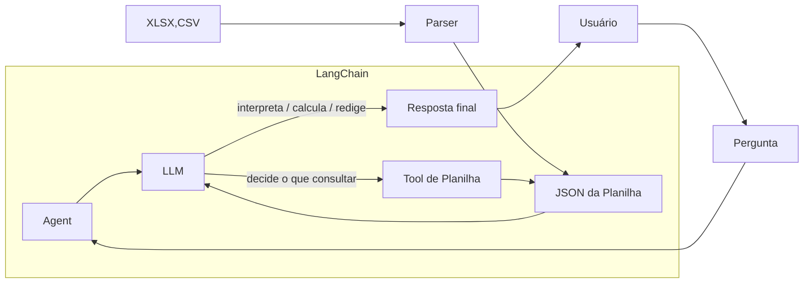

# Arquitetura

## 1. Visão geral

O NLQ responde **perguntas em linguagem natural** sobre dados de planilhas
(XLSX/CSV). O caminho é direto: o agente conversa com o LLM, o LLM decide o que
consultar, uma **ferramenta de planilha** devolve os dados em **JSON**, e o LLM
interpreta, calcula e redige a resposta final.

O projeto é **agnóstico de planilha**: o núcleo não conhece fórmulas nem layouts
específicos. Detalhes do agente em [`agent.md`](agent.md).

## 2. Componentes

| Componente            | Onde                        | Papel                                                            | Estado       |
|-----------------------|-----------------------------|------------------------------------------------------------------|--------------|
| Interface (CLI)       | `src/nlq/main.py`           | Recebe a pergunta e imprime a resposta                            | **Atual**    |
| Agente (LangChain)    | `src/nlq/agent/agent.py`    | Orquestra o ciclo LLM ↔ ferramenta                               | **Atual**    |
| LLM (OpenRouter)      | `src/nlq/agent/agent.py`    | Decide o que consultar, interpreta os dados e redige a resposta   | **Atual**    |
| Tool de planilha      | `src/nlq/agent/agent.py`    | Tool registrada no agente que expõe os dados da planilha          | **A implementar** |
| Parser (XLSX/CSV)     | —                           | Lê o arquivo e converte para JSON consumível pelo LLM              | **A implementar** |
| Resposta final        | `src/nlq/main.py`           | Texto devolvido ao usuário                                       | **Atual**    |

## 3. Fluxo de uma pergunta

1. **Entrada** — o usuário digita a pergunta na CLI.
2. **Agente → LLM** — o agente encaminha a pergunta ao modelo.
3. **Decisão** — o LLM decide o que precisa consultar na planilha.
4. **Consulta** — o LLM chama a **tool de planilha**; o **parser** lê o
   XLSX/CSV e devolve o **JSON** da planilha.
5. **Volta ao LLM** — o JSON é devolvido ao modelo como contexto.
6. **Resposta** — o LLM interpreta, calcula e redige a resposta final.
7. **Saída** — a resposta é impressa para o usuário.

Não há etapa separada de validação, memória de conversa nem consulta em linguagem
estruturada: o LLM faz a interpretação e o cálculo sobre o JSON.

## 4. Princípios de projeto

- **Fidelidade** — a resposta deve refletir exatamente os dados; nada de inferir
  valores ausentes.
- **Confiabilidade** — falhas de execução devem ser explícitas e recuperáveis, não
  silenciosas.
- **Rastreabilidade** — a resposta é acompanhável até o dado de origem.
- **Agnóstico de planilha** — o núcleo não pode assumir um layout específico.
- **Extensibilidade** — novas ferramentas e novos modelos entram sem reescrever
  o núcleo.

## 5. Dívidas técnicas conhecidas

- **Tool de planilha e parser ausentes** — o agente roda com `tools=[]` e responde
  sem consultar dados.
- **Prompt de sistema provisório** — "Você é um assistente útil e objetivo." não
  orienta fidelidade nem uso de ferramenta.
- Sem testes automatizados.

## 6. Evoluções possíveis

Ideias fora do escopo atual (NL2SQL, RAG, AST, memória, validação, múltiplas
ferramentas) estão em [`possible_implements.md`](possible_implements.md).
